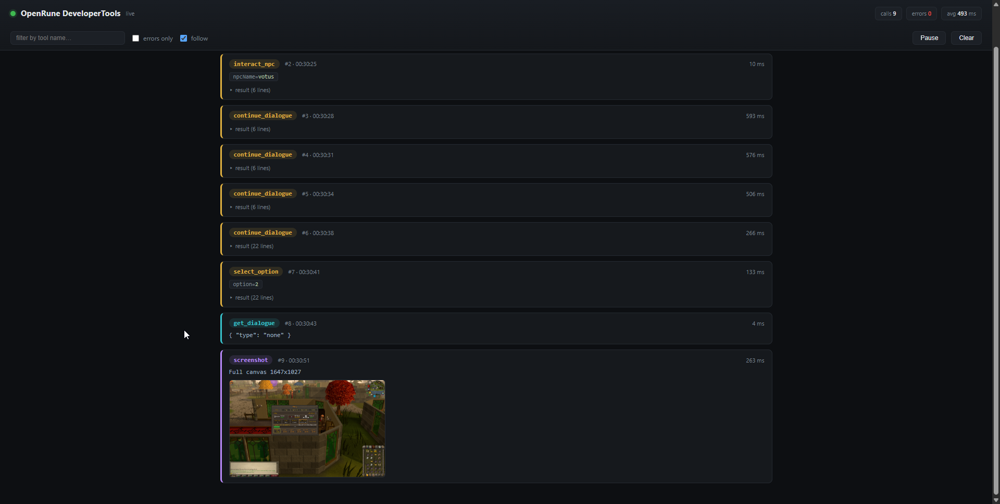

# OpenRune-Developer-Tools

Standalone sideloaded plugin for RuneLite-based clients. Runs a local MCP server
(default `http://127.0.0.1:7780/mcp`) so AI tools like Claude can screenshot
interfaces, inspect widgets/NPCs/objects/items, drive input (click, drag, type,
dialogue) and read script/var/projectile/chat history. Live activity dashboard
at `http://127.0.0.1:7780/` shows every AI tool call with args, results and
screenshots.

## Build and deploy

Local builds compile against the Fluxious client's shaded jar (build it first
with `gradlew :runelite-client:shadowJar`; override the path with
`-PfluxClientJar=...`). Without it, the build falls back to the upstream
RuneLite client artifact.

```
gradlew jar
```

The jar automatically deploys to each client's sideload folder:

- `~/.runelite/sideloaded-plugins/`
- `~/.rsprox/sideloaded-plugins/`
- `~/.fluxious/sideloaded-plugins/`

Start the client with `--developer-mode`, enable **OpenRune-DeveloperTools**,
then connect Claude:

```
claude mcp add --transport http flux http://127.0.0.1:7780/mcp
```

## Dashboard

While the plugin is running, `http://127.0.0.1:7780/` serves a live activity
dashboard — open it in a browser to watch what the AI is doing in real time:



- Every MCP tool call as it happens: tool name, arguments as chips, duration,
  timestamp, with slow calls (>1s) and errors highlighted.
- Results inline: JSON pretty-printed and collapsible, screenshots as thumbnails
  with a click-to-zoom lightbox.
- Header stats for the session: total calls, errors, average duration, live
  connection indicator.
- Filter by tool via dropdown, errors-only toggle, pause/resume, follow
  (auto-scroll) and clear.

The page polls `GET /log?after=<id>` (same port) for new entries; the server keeps
the last 100 calls in memory, so refreshing the page replays recent history.

## Releases

Pushing to the `prod` branch builds the jar and publishes a GitHub release
automatically.

## Tools

### Inspection

| Tool | Description |
|---|---|
| `screenshot` | PNG of the canvas; crop to a widget (`componentId`), whole interface (`interfaceId`) or region |
| `get_widget` | Widget values by packed id: bounds, position, text, item, sprite, hidden, children |
| `dump_interface` | Every component of an interface with positions/sizes/text — diff two dumps to spot layout changes |
| `list_interfaces` | Interface ids currently loaded and visible |
| `get_widget_at` | Deepest visible widget at a canvas pixel, with parent chain |
| `set_widget` | Live-edit a widget client-side: move, resize, hide, retext, recolor, then revalidate |
| `get_client_state` | Game state, canvas size, mouse, player position/region, energy, weight, camera, menu-open flag |
| `get_skills` | All skills: level, boosted level, xp, total level |

### Raw input

| Tool | Description |
|---|---|
| `click` | Click at canvas coordinates (real mouse events) |
| `click_component` | Click the center of a widget by packed id |
| `hover` | Move the mouse to coordinates or a widget center |
| `drag` | Press, drag through interpolated points, release — components or coordinates |
| `type_chat` | Type into the chatbox and send (works for `::` commands) |
| `press_key` | Press one key: char, ENTER, ESCAPE, SPACE, TAB, arrows, F1-F12 |

### World

| Tool | Description |
|---|---|
| `walk_to` | Click a world tile to walk there (viewport, or minimap when off-screen) |
| `list_npcs` | NPCs with id, index, name, actions, location, distance, animation, facing, health |
| `list_players` | Players with name, location, distance, animation, facing, health; local flagged |
| `list_objects` | Scene objects (game/wall/decorative/ground) with id, name, actions, position, orientation |
| `list_ground_items` | Floor items with id, name, quantity, location, distance |
| `pickup_item` | Invoke Take on a ground item at world coordinates |
| `list_projectiles` | Projectiles in flight with target info |
| `get_inventory` | Any item container by id (93 inventory, 94 worn, 95 bank, custom) with slots/names/quantities |
| `list_inventories` | All loaded item containers |

### Interaction (one call, no screenshots)

| Tool | Description |
|---|---|
| `interact_npc` | Invoke a cache-defined NPC option (default Talk-to) |
| `get_npc_menu` | Hover an NPC and read its live right-click menu, incl. server-added options |
| `click_menu_option` | Click an entry of the currently built mini-menu |
| `item_action` | Right-click an inventory item and click an option (Drop, Eat, Wield...) |
| `interact_object` | Nearest matching object, hover, click option (Chop down, Mine, Open...) |
| `interact_player` | Hover a player and click an option (Trade with, Follow...) |
| `widget_action` | Right-click any widget and click a menu option (spells, prayers, buttons) |
| `invoke_menu_action` | Raw `menuAction` escape hatch with explicit params |

### Dialogue

| Tool | Description |
|---|---|
| `get_dialogue` | Current dialogue: NPC/player text, options menu, message box, item box, input prompt |
| `continue_dialogue` | Press space, return the new dialogue state as soon as it changes |
| `select_option` | Pick a numbered dialogue option, return the new state |
| `enter_input` | Type into an open chatbox input (string/amount) and press Enter |

### History and vars

| Tool | Description |
|---|---|
| `get_script_history` | Clientscripts fired recently: per-script counts + events with tick and args |
| `get_var_history` | Varbit/varp/varc changes with old/new values, tick, timestamp |
| `get_var` | Current value of a varbit, varp, varc int or varc string |
| `get_projectile_history` | Projectiles launched recently, one entry each, with values and target |
| `get_effect_history` | Animations and graphics played by NPCs/players recently |
| `get_chat_history` | Chatbox messages: type, sender, message, tick, timestamp |

### Waiting

| Tool | Description |
|---|---|
| `wait_for` | Block until a condition: idle, at_tile, npc_dead, dialogue, interface_open/closed, chat_message — checked every 100ms, returns immediately when met |
